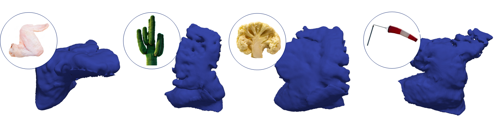
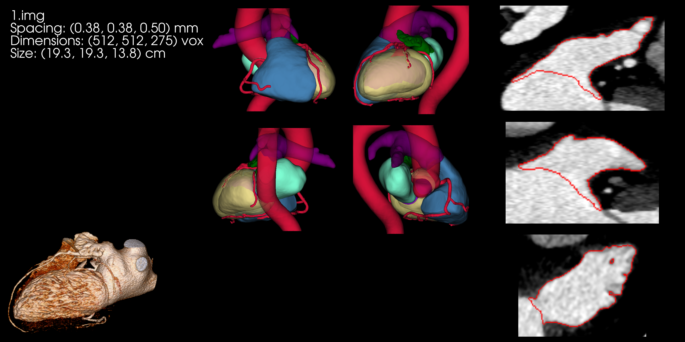
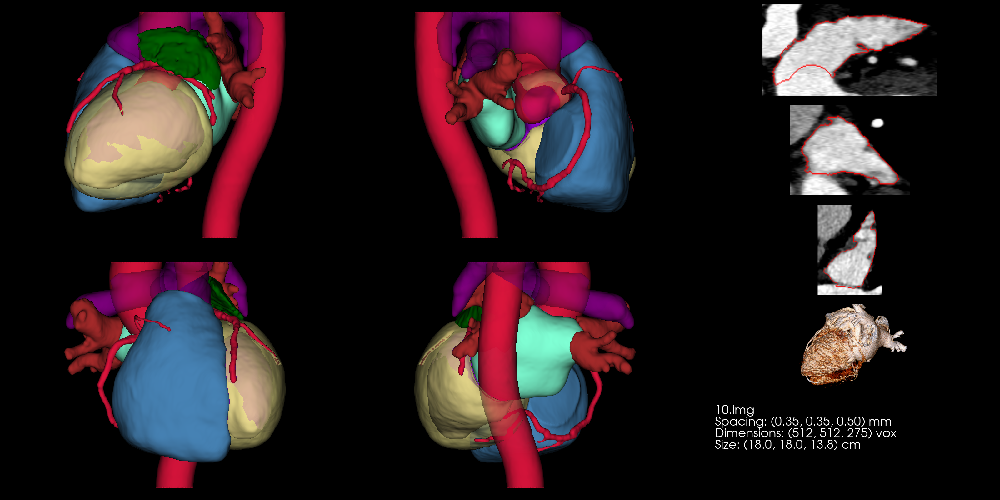
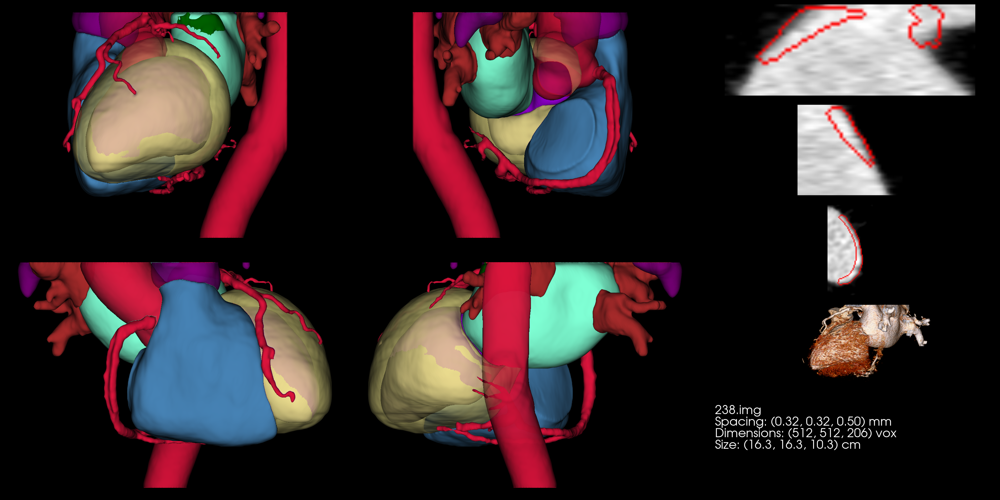
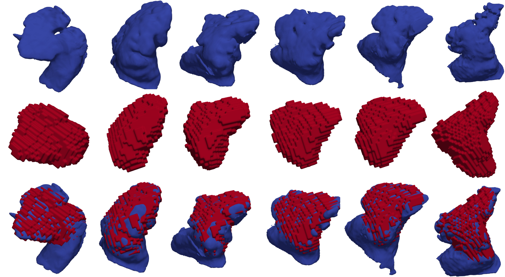
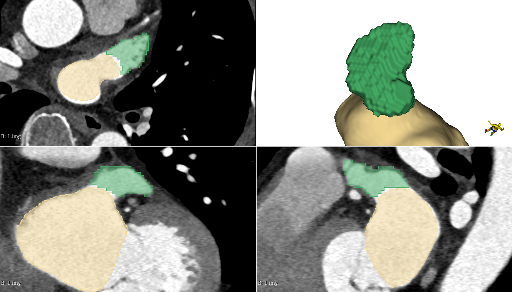
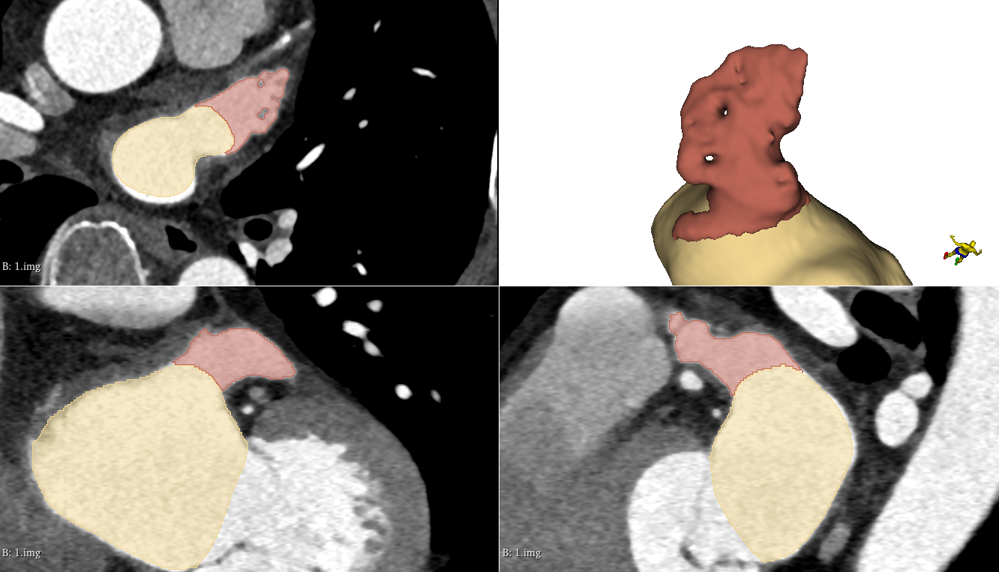
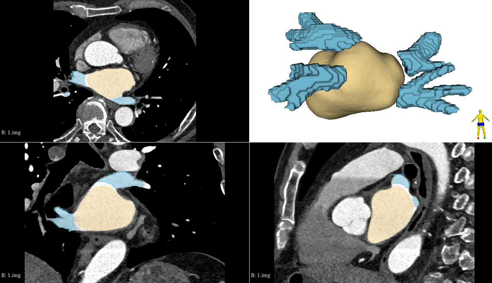
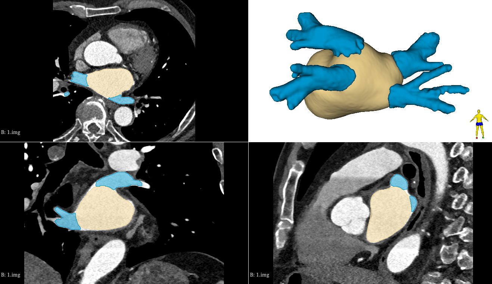

# STACOM2025: A Public Cardiac CT Dataset Featuring the Left Atrial Appendage

Official GitHub repo for the article "A Public Cardiac CT Dataset Featuring the Left Atrial Appendage" published at the [STACOM 2025 MICCAI workshop.](https://stacom.github.io/stacom2025/) 
[](./LICENSE)

<p align="center">
  
</p>
<p align="center"><em>Representative variety of left atrial appendage (LAA) morphologies in the dataset.</em></p>

## Table of contents
- [Introduction](#introduction)
- [Download](#download)
- [Dataset description](#dataset-description)
- [Excluded scans](#excluded-scans)
- [Full vs. partial LAAs](#full-and-partial-left-atrial-appendages)
- [Scripts](#supplied-processing-scripts)
- [Visualization](#visualization)
- [Notes on usage](#notes-on-usage)

## Introduction

**The left atrial appendage (LAA)** is a small finger-like extension on the left atrium. It is suspected that a significant blood clot-related strokes originate in the LAA, and that the shape of the LAA is one of several factors influencing the risk of stroke. The variation in LAA morphology across a population is considerable, and there is ongoing research focused on characterizing and classifying these shapes.
For this purpose, we have created the dataset described here. We hope it can contribute to future stroke risk stratification, as well as serve as an example of naturally occurring variation in human organ shapes.

The data is described in this publication:

*Bjørn Hansen, Jonas Pedersen, Klaus F. Kofoed, Oscar Camara, Rasmus R. Paulsen and Kristine Sørensen.*
**A Public Cardiac CT Dataset Featuring the Left Atrial Appendage.**
Proceedings STACOM. 
MICCAI workshop on The Statistical Atlases and Computational Modeling of the Heart
Springer 2025

The article can be found here: [](https://arxiv.org/abs/2510.06090)

Please cite this article if you use the data:

```
@inproceedings{Hansen2025LAA,
  title       = {A Public Cardiac CT Dataset Featuring the Left Atrial Appendage},
  author      = {Hansen, Bj{\o}rn and Pedersen, Jonas and Kofoed, Klaus F. and Camara, Oscar and Paulsen, Rasmus R. and S{\o}rensen, Kristine},
  booktitle   = {Statistical Atlases and Computational Modeling of the Heart (STACOM), MICCAI Workshop},
  year        = {2025},
  publisher   = {Springer},
  url         = {https://arxiv.org/abs/2510.06090}
}
```

## Download
**NOTE:** If you just want to do LAA shape analysis, you just need to download the segmentation data. See the scripts described below on how to get started on the shape analysis.

**ImageCAS CCTA volumes** can be downloaded *here*: [](https://www.kaggle.com/datasets/xiaoweixumedicalai/imagecas). We refer to the ImageCAS GitHub: [](https://github.com/XiaoweiXu/ImageCAS-A-Large-Scale-Dataset-and-Benchmark-for-Coronary-Artery-Segmentation-based-on-CT)

**Segmentation data** can be downloaded as a zip file *here*: [](https://people.compute.dtu.dk/rapa/STACOM2025/ImageCAS-STACOM2025-02-10-2025.zip) (576 MB)

## Dataset description

For each scan, the following labels are computed:

- 0 : **Background**
- 1 : **Myocardium** : The muscle tissue surrounding the left ventricle blood pool
- 2 : **LA** : The left atrium blood pool
- 3 : **LV** : The left ventricle blood pool including the papilary muscles and trabeculation
- 4 : **RA** : The right atrium blood pool
- 5 : **RV** : The right ventricle blood pool
- 6 : **Aorta** : The aorta including the aortic cusp
- 7 : **PA** : The pulmonary artery
- 8 : **LAA** : The left atrial appendage
- 9 : **Coronary** : The left and right coronary arteries
- 10 : **PV** : The pulmonary veins

<p align="center">
  
  
</p>
<p align="center"><em>Multi-view 3D heart and slice overlays of provided data.</em></p>

## Excluded scans
The labelmaps are computed on the entire ImageCAS dataset, but we found that scan 90.img.nii.gz and 141.img.nii.gz are invalid and therefore no labelmaps are computed for them.

## Full and partial left atrial appendages

For each labelmap it is checked if the left atrial appendage touches the side of the scan due to a limited scan field-of-view. There are two file lists with image ids:

- `all_segmentations_id.txt` : Contains the 998 image ids of the computed label maps
- `all_full_laa_segmentations_id.txt` : Contains the 685 image ids of label maps with complete LAAs (that do not touches the CCTA scan side)


<p align="center">  </p> <p align="center"><em>Example of left atrial appendage outside field of view of CCTA scan.</em></p>

## Supplied processing scripts

We supply a set of processing scripts, to easy future use of the data. They are located in the `scripts` sub-folder. To use the scripts, you should change the folder names in the scripts to point to where you have unpacked the data.

### `stacom2025_extract_surfaces.py`

Extracts the surfaces of all complete left atrial appendages in the dataset. The surfaces are stored as VTK files. 

### `stacom2025_compute_shape_descriptors.py`

Computes a set of 3D shape descriptors based on the LAA surfaces extraced using `stacom2025_extract_surfaces.py`. The surface descriptors are currently:

- volume: Volume of the LAA (mm³)
- surface area: Area of the surface of the LAA (mm²)
- Normalized shape index as defined in the [VTK documentation](https://vtk.org/doc/nightly/html/classvtkMassProperties.html#details)
- Surface to volume ratio: Surface area divided by the volume
- Major axis length: The length of the first eigenvector computed by doing a PCA on the vertices of the mesh
- Minor axis length: The length of the second eigenvector computed by doing a PCA on the vertices of the mesh
- Least axis length: The length of the third eigenvector computed by doing a PCA on the vertices of the mesh
- [Elongation](https://pyradiomics.readthedocs.io/en/latest/features.html#radiomics.shape.RadiomicsShape.getElongationFeatureValue): The minor axis length divided by the major axis length
- [Flatness](https://pyradiomics.readthedocs.io/en/latest/features.html#radiomics.shape.RadiomicsShape.getFlatnessFeatureValue): The least axis length divided by the major axis length

The computed features are both stored as individual JSON files per scan and as a combined CSV file with all features for all scans.

### `stacom2025_explore_shape_descriptors.py`

Do a simple principal component analysis (PCA) explorative analysis of the computed shapes descriptors from `stacom2025_compute_shape_descriptors.py`.

## Visualization
<p align="center">  </p> <p align="center"><em>Top: our provided LAA segmentations. Mid: TotalSegmentator LAA segmentations. Bot: Overlaid segmentations.</em></p>

<p align="center">
  
  
</p>
<p align="center"><em>Left: TotalSegmentator LAA segmentation. Right: our provided LAA segmentation.</em></p>


<p align="center">
  
  
</p>
<p align="center"><em>Left: TotalSegmentator PV segmentation. Right: Refined PV segmentation.</em></p>


## Notes on usage

If you use these data with the original ImageCAS data or the TotalSegmentator derived segmentation, you should also cite the relevant [](https://github.com/XiaoweiXu/ImageCAS-A-Large-Scale-Dataset-and-Benchmark-for-Coronary-Artery-Segmentation-based-on-CT) and [TotalSegmentator](https://github.com/wasserth/TotalSegmentator) publications. Please also read the [TotalSegmentator license here](https://backend.totalsegmentator.com/license-academic/) if you consider using the TotalSegmentator derived labels.


